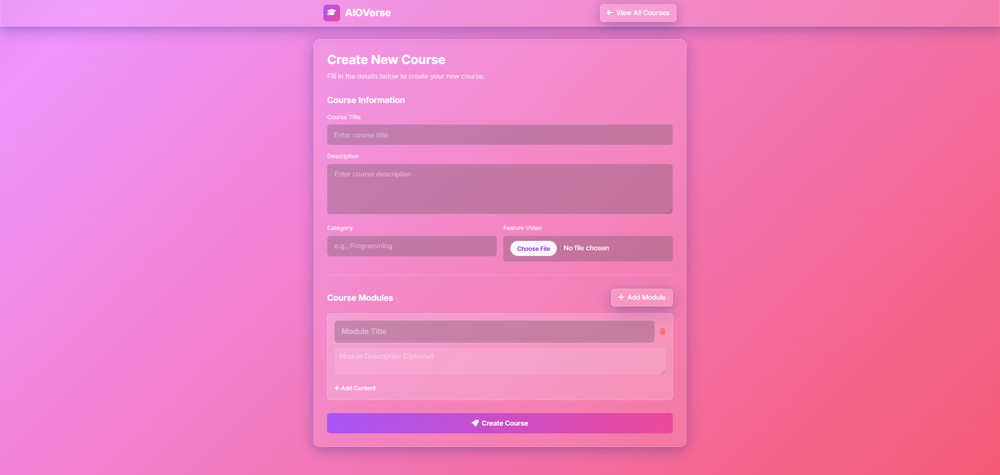
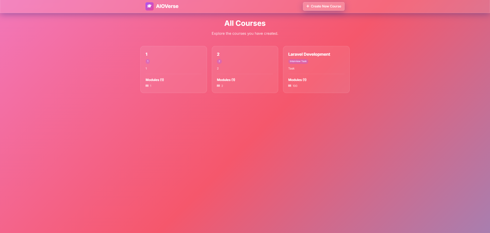
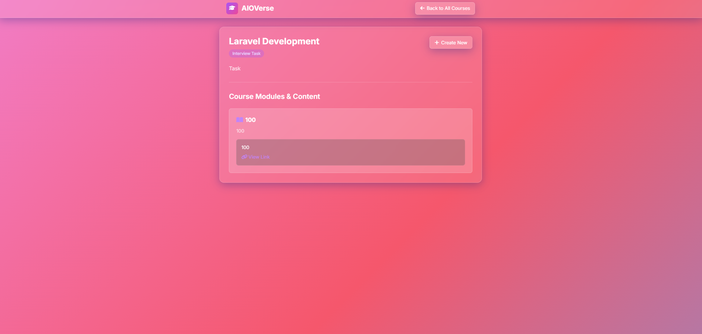

<p align="center">
  <a href="https://laravel.com" target="_blank">
    
  </a>
</p>

<h1 align="center">AIOVerse - Course Creation Platform</h1>

<p align="center">
  <em>A modern web application for creating and managing online courses — featuring a clean "glassmorphism" UI, dynamic content structure, and seamless user experience.</em>
</p>

---

## ✨ Features

- 🎨 **Dynamic Course Creation:** Create courses with titles, descriptions, categories, and feature video uploads.
- 📚 **Nested Modules & Content:** Add unlimited modules and multiple types of content (text, links) per course.
- ⚡ **Course Views:** Browse all courses and view details with modules and contents displayed clearly.
- 🛡️ **Robust Validation:** Backend validation via Laravel Form Requests.
- 🎯 **Data Integrity:** Database transactions ensure consistent data saving.
- 📱 **Responsive Design:** Futuristic glassmorphism UI built with Tailwind CSS.
- 🗂️ **File Uploads:** Secure handling of video uploads.

---

## 🛠️ Tech Stack

<p align="center">
  
  
  
  
  
  
  
</p>

- **Backend:** Laravel 12.x  
- **Frontend:** Blade, HTML5, CSS3, JavaScript, jQuery  
- **Database:** MySQL  
- **Styling:** Tailwind CSS  
- **Icons:** Font Awesome  

---

## 🚀 Getting Started

Follow these steps to set up the project locally.

### Prerequisites
- PHP >= 8.2  
- Composer  
- MySQL  
- Node.js & NPM  

### Installation

1. **Clone the repository**
   ```bash
   git clone https://github.com/AION-2000/Course_Builder_AIOVerse.git
   cd course-builder
Install dependencies

bash
Copy code
composer install
Set up environment

bash
Copy code
cp .env.example .env
php artisan key:generate
Update .env with your database credentials.

Run migrations

bash
Copy code
php artisan migrate
Link storage

bash
Copy code
php artisan storage:link
Run the app

bash
Copy code
php artisan serve
Visit: http://127.0.0.1:8000

📸 Screenshots
Create Course Page
<p align="center">  </p>
All Courses Page
<p align="center">  </p>
Course Details Page
<p align="center">  </p>
🧭 Project Structure
Follows Laravel’s MVC (Model–View–Controller) architecture:

Models: Course, Module, Content

Controllers: Manage CRUD logic and relationships

Views: Blade templates for UI

📜 License
This project is open-sourced under the MIT License.

<p align="center">Built with ❤️ using Laravel & Tailwind CSS</p> ```
